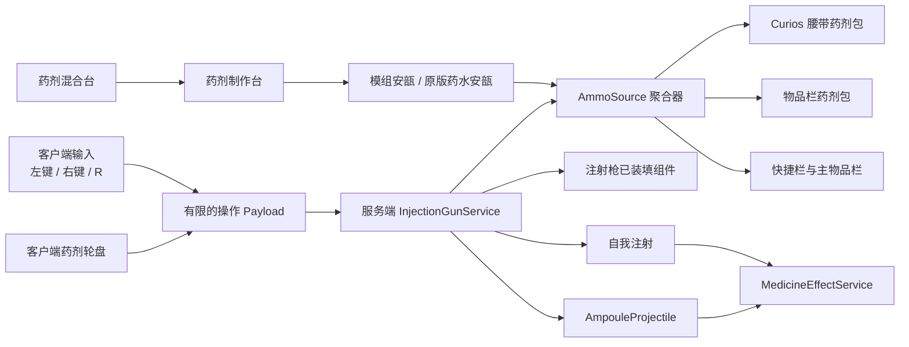

# 注射系统重构技术设计

## 1. 设计目标

在不升级 Minecraft、NeoForge 或 Java 的前提下，把现有针剂重构为服务器权威的“注射枪 + 安瓿”系统，并使药剂包、可选 Curios、投射物和两台加工机器共享一致的数据与校验规则。

核心原则：

- 保留现有注册 ID，降低已有世界迁移风险。
- 客户端只表达输入和选择，所有物品消耗、换弹、药效与耐久变更均由服务器完成。
- 装填和换弹采用可回滚事务，任何失败都不得复制或吞掉物品。
- 使用原版 `ItemStack` 组件相等语义区分不同原版药水安瓿。
- 客户端 Screen、按键和渲染类不进入通用初始化路径。

## 2. 项目上下文

- Minecraft：1.21.1
- NeoForge：21.1.230
- ModDevGradle：2.0.141
- Parchment：1.21.1 / 2024.11.17
- Java：21
- 基础包：`cn.autoforged.syringe_mod`
- 现有注册风格：`DeferredRegister`
- 现有网络：NeoForge payload registrar，协议版本 `"1"`
- 现有数据生成：`runData` 输出至 `src/generated/resources`
- 基线验证：`gradlew.bat compileJava` 已通过

## 3. 总体架构

## 4. 物品与数据模型

### 4.1 注册兼容

- 新增 `syringe_mod:injection_gun`。
- 现有 `cure_injection`、`stem_cell_injection` 等 `*_injection` ID 保持不变，但注册类改为 `AmpouleItem` 或其特化子类。
- 删除旧 `SyringeItem`、`ExperimentalSyringeItem`、`ImmunitySyringeItem` 的直接注射职责；迁移完成且无引用后移除这些旧实现类，不保留可绕过注射枪使用的旧注射器物品。
- 移除这些安瓿的 `FoodProperties`，使其不再进入食用流程。
- 所有安瓿普通最大堆叠数为 16，并加入 `syringe_mod:ampoules` 标签。
- 现有 `syringe_mod:syringes` 标签保留一个版本作为兼容别名，但内部逻辑统一迁移到 `ampoules`。
- 新增 `syringe_mod:potion_ampoule`，通过原版 `DataComponents.POTION_CONTENTS` 保存药水内容。

### 4.2 注射枪组件

注册类型安全的数据组件 `LOADED_AMPOULE`，值为数量固定为 1 的 `ItemStack`：

- 不允许保存药剂包、注射枪或非安瓿物品。
- 保存和网络同步使用 `ItemStack` 的注册表感知 codec/stream codec。
- 枪的模型状态之后可依据“空枪/已装填”组件做覆盖。
- 注射枪 `stacksTo(1)`、`durability(64)`。
- 注射枪加入原版 `minecraft:unbreaking`（简中“耐久”）附魔的适用物品标签，并提供适当的附魔能力。
- 总施药容量按 `64 + 16 × 耐久附魔等级` 计算；0–3 级分别为 64、80、96、112 次。
- 每次成功自我注射或发射固定增加 1 次已用计数，不调用原版“不毁”概率免伤流程；空枪操作不增加计数。
- 使用类型安全的 `USED_DOSES` 数据组件保存已用次数，并由 `InjectionGunItem` 根据动态总容量绘制耐久条。达到当前容量时销毁注射枪。

### 4.3 药剂包组件

把现有散落的 `CUSTOM_DATA/SyringeBag` 访问封装为 `MedicineBagContents`：

- 固定 9 个内部槽位。
- 每槽只接受 `ampoules` 标签。
- 内部每槽允许 64 发，即使该安瓿在普通容器中的上限为 16。
- 菜单取出到玩家物品栏时，由目标槽上限自动拆成最多 16 发一组。
- 第一次读取旧 `SyringeBag` NBT 时迁移到新组件；保存成功后不再写旧格式。
- 禁止包套包。

`MedicineBagItemHandler` 覆盖内部堆叠限制，并集中处理序列化、合法性和 `onContentsChanged`，避免网络处理器、菜单和快捷键各自复制 NBT 逻辑。

## 5. 药效模型

新增 `MedicineEffectService`，统一处理模组安瓿与原版药水安瓿：

- 输入：来源实体、目标 `LivingEntity`、数量为 1 的安瓿快照。
- 模组安瓿：迁移现有八种药效、实验药剂 3% 致死概率、免疫药剂清除效果、饥饿副作用和使用统计。
- 原版药水安瓿：读取 `POTION_CONTENTS` 并把全部效果施加给目标。
- 自我注射时来源与目标相同；射击时来源为射手、目标为命中实体。
- 对玩家目标保留药剂冷却和过量使用记录；非玩家生物只应用可用药效。
- 所有药效只在逻辑服务器执行一次。

原 `SyringeItem`、`ExperimentalSyringeItem` 和 `ImmunitySyringeItem` 中的直接使用逻辑将迁入这一服务，安瓿本身的 `use` 返回失败或透传，不触发任何效果。

## 6. 换弹来源与事务

### 6.1 扫描顺序

`AmmoSourceResolver` 以如下顺序构造来源：

1. Curios 标准 `belt` 槽中装备的药剂包；
2. 玩家物品栏中的药剂包，按玩家槽位顺序，再按包内 0–8 槽顺序；
3. 快捷栏 0–8；
4. 主物品栏从左上到右下。

短按 `R` 选择这个顺序中第一发合法安瓿。轮盘则聚合所有来源，按 `ItemStack.isSameItemSameComponents` 分组并显示总数。

### 6.2 无损换弹

换弹使用“预检 → 模拟 → 提交”三阶段：

1. 验证玩家主手是注射枪，目标药剂存在且合法。
2. 模拟为当前未使用安瓿寻找返还位置，并模拟从目标来源取出新安瓿。
3. 只有返还和取出两项模拟都成功才提交：先把枪膛内旧安瓿退回药剂包优先的合法位置，再取出新安瓿并写入枪组件。

若当前枪为空，不需要返还步骤。若所选药剂与当前弹药完全相同，可保持当前弹药并不产生无意义搬运。任何失败均保持所有来源和枪不变。

## 7. 输入与瞄准

### 7.1 按键

- 注册可重新绑定的 `key.syringe_mod.reload`，默认键为 `R`。
- 仅在玩家主手物品是 `InjectionGunItem` 时累计按住时间、发送换弹请求或打开轮盘；其他情况下立即清空本模组的按键计时状态，不消费该按键。
- 客户端 tick 只用于区分 `R` 持续时间，不扫描世界或修改物品。
- `R` 在 8 tick 前释放：发送快速换弹请求。
- 持续到 8 tick：打开药剂轮盘一次，不再在释放时触发快速换弹。

### 7.2 左键

通过 NeoForge 客户端交互按键事件拦截“主手持注射枪”的攻击键：

- 玩家未处于右键使用注射枪状态：取消原版攻击/挖掘并发送自我注射请求。
- 玩家正在右键使用注射枪：取消原版攻击/挖掘并发送射击请求。
- 其他物品完全不受影响。

服务器收到请求后重新检查主手、冷却、瞄准状态和已装填组件。右键 `use` 只负责维持瞄准姿态，不直接消耗药剂。

### 7.3 动作状态与动画

新增服务器权威的 `GunActionController`，为正在执行动作的玩家保存：

- 动作类型：`SELF_INJECT`、`QUICK_INJECT`、`RELOAD`；
- 开始与结束 game tick；
- 注射枪所在位置及开始时的堆栈标识；
- 待换装药剂原型（仅换弹）；
- 是否已经到达提交时点。

时序：

- 普通自我注射：12 tick，结束时重新验证并提交药效、药剂和容量。
- 快速注射：8 tick，结束时重新验证并提交。
- 换弹：14 tick，结束时重新解析来源并原子提交退弹与装弹。
- 射击：服务器验证后立即发射，客户端播放 4 tick 后坐；已经创建的投射物不受后续动画取消影响。

玩家可以在动作期间移动，但新的注射枪动作会被服务器拒绝。切换物品、死亡、失去对应枪或打开不兼容界面会取消尚未提交的动作。

服务器通过有界的客户端动画通知同步动作类型、实体 ID、开始 tick 和固定时长。客户端分别处理：

- 第一人称手持枪变换；
- 第三人称持枪手臂姿势；
- 其他玩家的动作表现；
- 快速注射使用快捷栏或主物品栏中的枪时，显示临时枪体并播放对应第一、第三人称动作。

动画渲染与姿势注册仅位于 client 包；通用服务端只保存动作状态和广播必要参数。

## 8. 网络协议

现有协议版本从 `"1"` 提升为 `"2"`，不与旧客户端静默兼容。

### Serverbound

- `InjectionGunActionPayload(action)`：
  - `SELF_INJECT`
  - `FIRE`
  - `QUICK_RELOAD`
  - `QUICK_INJECT`
- `SelectAmpoulePayload(ItemStack prototype)`：
  - 数量强制规范为 1；
  - 只用于标识希望装填的物品及组件；
  - 服务端不信任该堆栈内容，只在真实来源中搜索完全匹配项。

### Clientbound

- `GunAnimationPayload(entityId, action, startGameTick, duration)`：
  - 仅发送固定枚举与有界整数；
  - 发送给动作玩家及追踪该玩家的客户端；
  - 只驱动表现，不允许客户端据此施加药效或修改物品。

### 校验与限流

- payload 仅在 play 阶段注册。
- 解码无副作用，变更排入服务器游戏线程。
- 每个请求验证主手物品、玩家存活、组件合法、冷却与操作状态。
- 选择 payload 拒绝非安瓿、数量异常和无法在来源中找到的组件组合。
- 服务端为换弹与射击维护最小间隔，防止客户端高频包绕过 10 tick 冷却。

轮盘内容由客户端从已同步的玩家物品栏、药剂包组件和 Curios 槽构建；最终选择始终由服务器重新解析，因此不需要额外的服务端列表响应包。

## 9. 药剂轮盘与 GUI 设计规范

### Purpose Statement

轮盘用于在战斗中快速识别库存内的药剂类型、余量和当前装填状态，不暂停世界，也不承担库存整理功能。机器 GUI 则强调输入、加工、阻塞和输出状态。

### Aesthetic Direction

工业实用主义，延续 Minecraft 像素界面；避免网页式卡片和高分辨率装饰。

### Color Palette

- 炭铁：`#2B2D2F`
- 旧木：`#6B4A2F`
- 帆布：`#D8D2C4`
- 药剂青：`#71C7C4`
- 警示红：`#C84B3F`

### Typography

使用 Minecraft 内置位图字体。这是目标平台的可读性与资源一致性约束，不引入外部字体。

### Layout Strategy

- 轮盘必须围绕准星居中，这是方向选择交互的功能要求。
- 药剂轮盘属于首版必做功能，不得降级为聊天命令、按键逐项轮换或普通列表菜单。
- 打开轮盘时调用 Minecraft Screen 的鼠标释放流程，显示系统鼠标光标并允许点击；关闭、取消或完成选择时恢复游戏的鼠标捕获状态。
- 每页最多 8 个扇区；扇区显示安瓿图标和总数。
- 当前装填药剂用内圈标记，鼠标悬停扇区向外抬升 2 像素并显示本地化名称。
- 药剂超过 8 种时使用滚轮分页，中心显示页码。
- 长按达到阈值后打开；点击扇区确认，`Esc` 或无选择释放 `R` 取消。
- Screen 的 `isPauseScreen()` 返回 `false`。

机器 GUI 保持原有槽位数量，用不对称设备特征区分：

- 制作台：进度区域表现为锅体加热，三个输入围绕锅、输出位于右侧。
- 混合台：两个输入位于转子两侧，进度表现为旋转阶段，输出位于下方偏右。
- 在没有正式贴图前复用现有 GUI 小部件资源，不生成占位二进制图片。

## 10. 投射物

新增 `AmpouleProjectile` 与对应实体类型：

- 分类：`MobCategory.MISC`
- 小型碰撞箱，客户端跟踪范围覆盖至少 32 格。
- 服务器保存所有者 UUID/原版 projectile owner 与数量为 1 的安瓿快照。
- 发射速度和寿命调校为约 32 格实用射程，采用无重力或极弱下坠。
- 命中首个 `LivingEntity`：应用一次药效并立即移除。
- 命中方块、超时、跨维度异常或所有者状态失效：直接移除，不掉落、不返还。
- 不造成额外物理伤害，不可拾取。
- 客户端首版使用轻量投射物渲染器显示对应安瓿物品；正式模型后再替换。

发射动作在创建实体前清空枪膛并损耗耐久，因此即使投射物未命中也不会返还药剂。

## 11. Curios 可选兼容

- `build.gradle`：Curios API 改为 `compileOnly`，开发运行使用 `localRuntime`。
- `neoforge.mods.toml`：Curios 依赖改为 `optional`。
- 通用代码只依赖项目内的 `AccessoryBagBridge` 接口。
- 启动时先使用 `ModList` 检测 `curios`，再通过仅字符串引用的实现工厂加载 Curios 类，避免未安装时验证器解析 Curios 类型。
- 已安装时读取标准 `belt` 槽；未安装时 bridge 返回空来源。
- 删除或迁移现有自定义 `injection_kit` 槽数据，避免同时出现两个含义相同的饰品槽。

## 12. 制作台与混合台

### 制作台

- 保留 3 输入 + 1 输出、80 tick、无燃料。
- 保留现有 `PotionCraftingRecipe`。
- 新增一种动态配方：任意普通原版 `Items.POTION` 经过 80 tick 转换为 1 个 `potion_ampoule`，复制其 `POTION_CONTENTS`。
- 喷溅药水和滞留药水不匹配。
- 动态输出在 `assemble` 时从输入复制组件，不能在 JSON 中写死结果。

### 混合台

- 保留 2 输入 + 1 输出、80 tick、无燃料和现有配方。
- 本轮不自动合并任意两种原版药水，以免产生未定义的效果冲突。

### 机器状态

抽取共享加工辅助逻辑或至少统一以下行为：

- 配方不存在：进度归零。
- 输出阻塞：进度暂停并同步阻塞状态，不消耗输入。
- 配方或输入变化：重新校验结果和组件。
- 完成时先计算 crafting remainder，再原子消耗输入和写入输出。
- `ContainerData` 同步 `progress`、`maxProgress` 和状态枚举。
- 保留方块能力的方向插入/提取规则。

## 13. 文件边界

预计新增或重构：

- `item/AmpouleItem.java`
- `item/InjectionGunItem.java`
- `item/MedicineEffectService.java`
- `item/MedicineBagContents.java`
- `item/MedicineBagItemHandler.java`
- `item/AmmoSourceResolver.java`
- `component/ModDataComponents.java`
- `entity/AmpouleProjectile.java`
- `entity/ModEntities.java`
- `client/InjectionWheelScreen.java`
- `client/ModClientEvents.java`
- `network/ModPayloads.java`
- `network/payload/InjectionGunActionPayload.java`
- `network/payload/SelectAmpoulePayload.java`
- `integration/AccessoryBagBridge.java`
- `integration/curios/CuriosAccessoryBagBridge.java`
- 动态原版药水安瓿配方及 serializer
- 现有两个方块实体、菜单、Screen、数据生成和语言文件

## 14. 验证策略

### 静态与构建

- `gradlew.bat compileJava`
- `gradlew.bat runData`
- `gradlew.bat build`
- 检查生成资源未包含 `.cache` 与 `examplemod` 残留。

### 逻辑检查

- 药剂包、物品栏和枪膛之间的模拟换弹事务。
- 不同 `POTION_CONTENTS` 不合并。
- 包内 64 发取到普通背包时拆成 16。
- 旧 `SyringeBag` NBT 迁移。
- 空枪、满背包换弹、相同药剂换弹、恶意选择 payload。
- 自注射与投射命中只应用一次效果。
- 普通注射 12 tick、快速注射 8 tick、换弹 14 tick 和射击后坐 4 tick 的提交与取消边界。
- 验证无附魔与耐久Ⅰ/Ⅱ/Ⅲ分别在第 64、80、96、112 次有效施药后损坏；不存在随机免除计数，空操作不损耗。
- 机器输出堵塞、输入变化和动态药水组件复制。

### 运行检查

- 单人客户端：R 短按、长按、滚轮、点击与取消。
- 双客户端：投射物跟踪和药效只执行一次。
- 专用服务器：无客户端类加载错误。
- Curios 存在和不存在两套启动测试。

## 15. 风险与处理

- **攻击键冲突**：只在主手是注射枪时取消攻击事件，避免影响其他物品。
- **包内超上限 ItemStack**：集中到自定义 handler，并重点测试菜单拖动、数字键和 shift-click。
- **可选 Curios 类加载**：通用代码不出现 Curios 类型签名，使用隔离实现。
- **动态药水组件**：配方输出、轮盘分组和服务端搜索全部使用完整组件相等，而不是只比较 item ID。
- **世界兼容**：保留现有安瓿注册 ID；药剂包旧数据提供迁移读取。
- **素材缺失**：首版只复用现有图标或明确占位模型，正式模型贴图留到后续视觉阶段。
